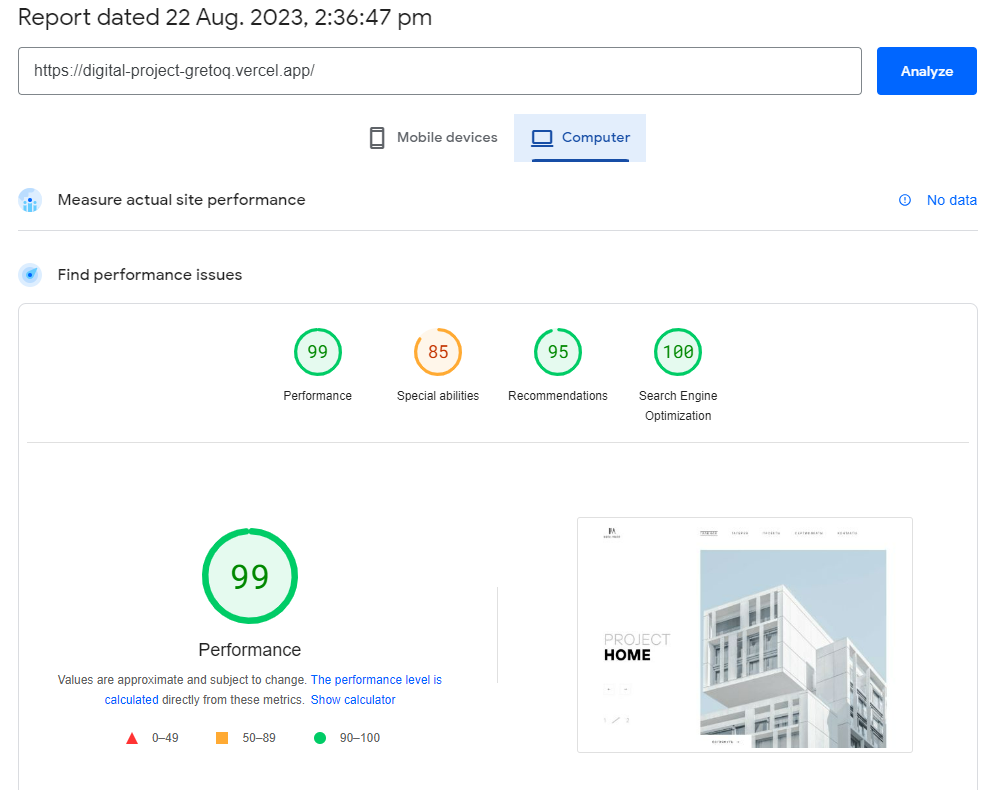

  

#

This is a React application designed for desktop devices. It includes a main page, routing to other pages, and various placeholder pages with minimal content (only displaying page names). There's also an error page (Not Found page) for when users enter an invalid URL. Styling is done using SCSS, and the layout is currently optimized for desktop, with the potential for expansion to other platforms in the future.

(Logo is a link to [deploy](https://digital-project-gretoq.vercel.app/) or [DEMO](https://digital-project-gretoq.vercel.app/), depending on personal preferences.)

## Technologies and Dependencies

- React
- React Router
- React Icons
- TypeScript
- ESLint
- Prettier
- Classnames
- JSX
- SASS
- other dependencies (see package.json)

## Pagespeed Optimization

Performance and accessibility optimizations have been implemented to enhance user experience. Below is a performance report from PageSpeed:

  

## Installation

0. Install Node.js version v20.5.1

1. Clone this repository to your computer.
2. Open a terminal and navigate to the project folder.
3. Run the command `npm install` to install the necessary dependencies.
4. Start the application with the command `npm start`.

## Usage

1. Open your web browser and go to `http://localhost:3000`.
2. Explore the main page with the banner, sections about the company and its goals, and the collection of projects.
3. Interact with interactive elements and navigate to detailed project descriptions.
4. Explore other pages, including "Not found", to test the handling of incorrect addresses.

## Contact

If you have questions or suggestions, please contact us:

- Email: dovhun.artem.job@gmail.com
- Social Media: [LinkedIn](https://www.linkedin.com/in/dovhun-artem/)

---

&copy; 2023 Have A Great Day!
